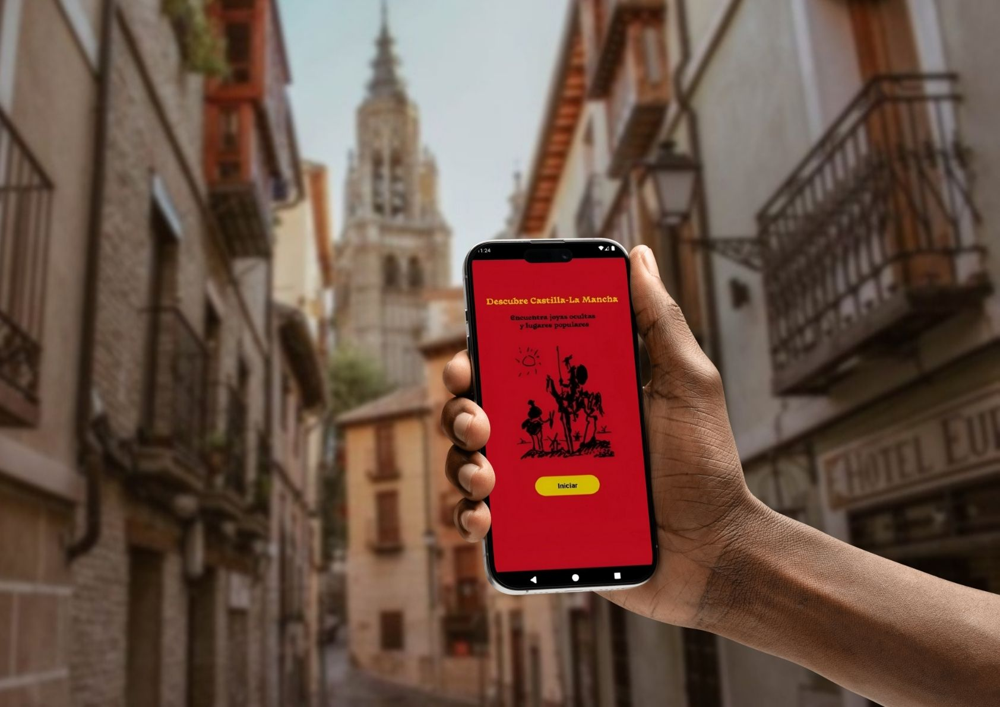

# Discover Castilla-La Mancha

## Visión General
**Discover Castilla-La Mancha** es una solución tecnológica diseñada para modernizar la promoción turística de la región. La aplicación centraliza la oferta cultural, histórica y natural de las cinco provincias (Toledo, Ciudad Real, Guadalajara, Cuenca y Albacete), conectando a los usuarios con recursos locales de forma intuitiva.

## Interfaz y Flujo de Usuario
He diseñado una experiencia centrada en el usuario (UX), facilitando el acceso a la información mediante layouts XML responsivos y un menú desplegable (*Navigation Drawer*).

## Stack Tecnológico
*   **Lenguaje:** **Kotlin**, elegido por su seguridad en el manejo de nulos y soporte oficial de Android.
*   **IDE:** **Android Studio**, probado en emuladores Pixel 7 y 8 Pro con Android 13.0.
*   **Backend & DB:** 
    *   **Firebase Authentication** para el registro e inicio de sesión seguro.
    *   **Firebase Realtime Database** para sincronización de datos en tiempo real.
    *   **Cloud Firestore** para la gestión del foro de comunidad.
*   **Testing:** **JUnit** para pruebas unitarias y **Espresso** para automatización de la interfaz.

## Funcionalidades Principales
*   **Exploración Provincial:** Módulos específicos con acceso a patrimonio, artesanía (cuchillería, cerámica) y naturaleza (Lagunas de Ruidera, Ruta del Quijote).
*   **Gestión Documental:** Descarga de guías turísticas oficiales en formato **PDF** directamente desde la app.
*   **Comunidad (Foro):** Espacio interactivo para que los usuarios publiquen experiencias y reseñas en tiempo real.

## Arquitectura y Diseño
El proyecto sigue el ciclo de vida de desarrollo de software, incluyendo:
*   **Diagrama de Casos de Uso:** Relación Usuario-Firebase para procesos de validación.
*   **Diagrama de Clases:** Estructura modular que define las relaciones entre provincias y servicios.

---
*Autor: Miguel Del Pino*
