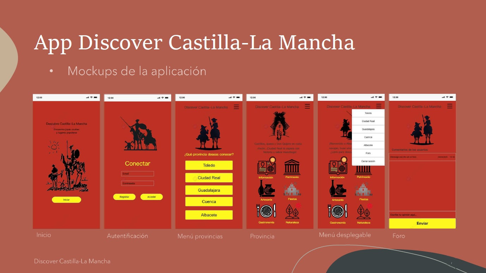

# Discover Castilla-La Mancha

## 🎯 Visión General
**Discover Castilla-La Mancha** es una solución tecnológica diseñada para modernizar la promoción turística de la región. La aplicación centraliza la oferta cultural, histórica y natural de las cinco provincias (Toledo, Ciudad Real, Guadalajara, Cuenca y Albacete), conectando a los usuarios con recursos locales de forma intuitiva.

## Stack Tecnológico
*   **Lenguaje:** Kotlin (elegido por su seguridad en el manejo de nulos y soporte oficial de Android).
*   **IDE:** Android Studio (Bumblebee/Flamingo).
*   **Backend & DB:** **Firebase Realtime Database** para sincronización en tiempo real y **Cloud Firestore** para la gestión del foro.
*   **Autenticación:** Firebase Authentication (Email/Password).
*   **UI/UX:** XML Layouts con diseño responsive para diversas versiones de Android.
*   **Testing:** JUnit para pruebas unitarias y **Espresso** para automatización de la interfaz.

## Funcionalidades Principales
*   **Sistema de Autenticación:** Registro e inicio de sesión seguro gestionado por Firebase.
*   **Exploración Provincial:** Módulos específicos por provincia con acceso a:
    *   **Patrimonio y Artesanía:** Información detallada sobre cerámica, bordados y cuchillería local.
    *   **Gastronomía y Naturaleza:** Guías sobre platos típicos y rutas naturales (Lagunas de Ruidera, Ruta del Quijote).
*   **Gestión Documental:** Descarga de guías turísticas oficiales en formato **PDF** directamente desde la app.
*   **Comunidad (Foro):** Espacio interactivo donde los usuarios publican experiencias y reseñas en tiempo real.
*   **Navegación Fluida:** Implementación de un menú desplegable (*Navigation Drawer*) para acceso rápido entre secciones y cierre de sesión.

## Arquitectura y Diseño
El proyecto sigue el ciclo de vida de desarrollo de software, incluyendo:
*   **Diagrama de Casos de Uso:** Relación Usuario-Firebase para procesos de validación y publicación.
*   **Diagrama de Clases:** Estructura modular que define las relaciones entre provincias, usuarios y servicios de Firebase.

---
*Autor: Miguel Del Pino Muelas*
